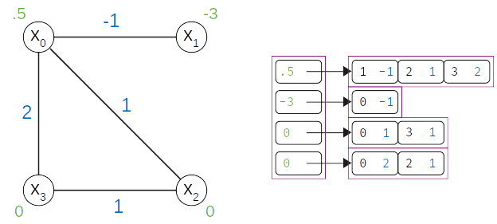

.. index_dimod:

=====
dimod
=====

.. toctree::
    :caption: Reference documentation for dimod:
    :maxdepth: 1

    reference/api_ref

About dimod
===========

.. include:: README.rst
  :start-after: start_dimod_about
  :end-before: end_dimod_about

For explanations of the terminology, see the
:ref:`Concepts <dwave:index_concepts>` section.

Usage Information
=================

.. todo:: add the intersphinx prefix to enable these links for dimod self builds

*   :ref:`index_concepts` for terminology
*   :ref:`concept_models` for descriptions of the supported models
*   :ref:`opt_model_construction_qm`
*   :ref:`concept_samplers` for using and creating samplers
*   :ref:`concept_samplesets` for samplesets returned from samplers
*   :ref:`concept_symbolic_math` for using symbolic math to build quadratic
    models
*   :ref:`opt_scaling` for building efficient models

Data Structure
==============

Quadratic models are implemented with an adjacency structure in which each
variable tracks its own linear bias and its neighborhood. The figure below shows
the graph and adjacency representations for an example BQM,

.. math::

    E(x) = .5 x_0 - 3 x_1 - x_0 x_1 + x_0 x_2 + 2 x_0 x_3 + x_2 x_3

    Adjacency structure of a 4-variable binary quadratic model.