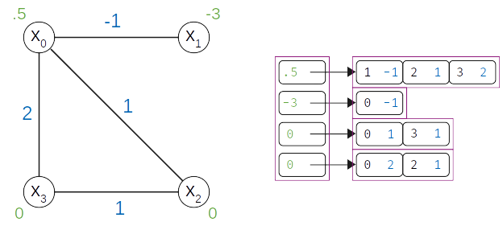

.. _intro_models:

============================
Models: BQM, CQM, QM, Others
============================

Constrained Versus Unconstrained
================================

Many real-world problems include constraints. For example, a routing problem
might limit the number of airplanes on the ground at an airport and a scheduling
problem might require a minimum interval between shifts.

Constrained models such as :class:`~dimod.ConstrainedQuadraticModel` can support
constraints by encoding both an objective and its set of constraints, as models
or in symbolic form.

Unconstrained quadratic models are used to submit problems to :term:`sampler`\ s
such as D-Wave quantum computers\ [#]_ and some hybrid quantum-classical
samplers\ [#]_.

When using such samplers to handle problems with constraints, you typically
formulate the constraints as penalties: see
:std:doc:`sysdocs_gettingstarted:doc_getting_started`.
(:ref:`Constrained models <intro_cqm>`, such as the
:class:`~dimod.ConstrainedQuadraticModel`, can support constraints natively.)

.. [#]
  D-Wave quantum computers accept unconstrained binary quadratic models, such as
  quadratic unconstrained binary optimization (\ :term:`QUBO`\ ) models: binary
  because variables are represented by qubits that return two states and quadratic
  because polynomial terms of two variables can be represented by pairs of coupled
  qubits.

.. [#]
  Some hybrid quantum-classical samplers accept constrained and non-binary models;
  for example, a quadratic model with an integer variable that must be smaller
  than some configured value.

Supported Models
================

.. _intro_qm_bqm:

* **Binary Quadratic Models**

  The :term:`binary quadratic model` (BQM) class,
  :class:`~dimod.binary.binary_quadratic_model.BinaryQuadraticModel`,
  encodes :term:`Ising` and quadratic unconstrained binary optimization
  (\ :term:`QUBO`\ ) models used by samplers such as D-Wave's quantum computers.

  For an introduction to BQMs, see
  :std:doc:`Concepts: Binary Quadratic Models <oceandocs:concepts/bqm>`. For the BQM class,
  its attributes and methods, see the :ref:`BQM reference documentation <bqm>`.

.. _intro_cqm:

* **Constrained Quadratic Model**

  The :term:`constrained quadratic model` (CQM) class, :class:`~dimod.ConstrainedQuadraticModel`,
  encodes a quadratic objective and possibly one or more quadratic equality and
  inequality constraints.

  For an introduction to CQMs, see
  :std:doc:`Constrained Quadratic Models <oceandocs:concepts/cqm>`. For
  descriptions of the CQM class and its methods, see :ref:`cqm`.

.. _intro_qm_qm:

* **Quadratic Models**

  The :term:`quadratic model` (QM) class, :class:`~dimod.QuadraticModel`, encodes
  polynomials of binary, integer, and discrete variables, with all terms of degree
  two or less.

  For an introduction to QMs, see
  :std:doc:`Concepts: Quadratic Models <oceandocs:concepts/qm>`. For the QM class,
  its attributes and methods, see the :ref:`QM reference documentation <qm>`.

* **Discrete Quadratic Models**

  The :term:`discrete quadratic model` (BQM) class,
  :class:`~dimod.DiscreteQuadraticModel`, encodes polynomials of discrete variables,
  with all terms of degree two or less.

  For an introduction to DQMs, see
  :std:doc:`Concepts: Discrete Quadratic Models <oceandocs:concepts/dqm>`. For the DQM
  class, its attributes and methods, see :ref:`DQM reference documentation <dqm>`.

.. _intro_nonquadratic:

* **Higher-Order Models**

  dimod provides some :ref:`higher_order_composites` and functionality
  such as reducing higher-order polynomials to BQMs.

Model Construction
==================

dimod provides a variety of model generators. These are especially useful for testing
code and learning.

See examples of using QPU solvers and `Leap <https://cloud.dwavesys.com/leap>`_
hybrid solvers on these models in Ocean documentation's
:std:doc:`Getting Started examples <oceandocs:getting_started>` and the
`dwave-examples GitHub repository <https://github.com/dwave-examples>`_.

Typically you construct a model when reformulating your problem, using such
techniques as those presented in D-Wave's system documentation's
:std:doc:`sysdocs_gettingstarted:doc_handbook`.

CQM Example: Using a dimod Generator
------------------------------------

This example creates a CQM representing a
`knapsack problem <https://en.wikipedia.org/wiki/Knapsack_problem>`_ of ten
items.

>>> cqm = dimod.generators.random_knapsack(10)

CQM Example: Symbolic Formulation
---------------------------------

This example constructs a CQM from symbolic math, which is especially useful for
learning and testing with small CQMs.

>>> x = dimod.Binary('x')
>>> y = dimod.Integer('y')
>>> cqm = dimod.CQM()
>>> objective = cqm.set_objective(x+y)
>>> cqm.add_constraint(y <= 3) #doctest: +ELLIPSIS
'...'

For very large models, you might read the data from a file or construct from a NumPy
array.

BQM Example: Using a dimod Generator
------------------------------------

This example generates a BQM from a fully-connected graph (a clique) where all
linear biases are zero and quadratic values are uniformly selected -1 or +1 values.

>>> bqm = dimod.generators.random.ran_r(1, 7)

BQM Example: Python Formulation
-------------------------------

For learning and testing with small models, construction in Python is
convenient.

The `maximum cut <https://en.wikipedia.org/wiki/Maximum_cut>`_ problem is to find
a subset of a graph's vertices such that the number of edges between it and the
complementary subset is as large as possible.

.. figure:: ../_images/four_node_star_graph.png
    :align: center
    :scale: 40 %
    :name: four_node_star_graph
    :alt: Four-node star graph

    Star graph with four nodes.

The `dwave-examples Maximum Cut <https://github.com/dwave-examples/maximum-cut>`_
example demonstrates how such problems can be formulated as QUBOs:

.. math::

   Q = \begin{bmatrix} -3 & 2 & 2 & 2\\
                        0 & -1 & 0 & 0\\
                        0 & 0 & -1 & 0\\
                        0 & 0 & 0 & -1
       \end{bmatrix}

>>> qubo = {(0, 0): -3, (1, 1): -1, (0, 1): 2, (2, 2): -1,
...         (0, 2): 2, (3, 3): -1, (0, 3): 2}
>>> bqm = dimod.BQM.from_qubo(qubo)

BQM Example: Construction from NumPy Arrays
-------------------------------------------

For performance, especially with very large BQMs, you might read the data from a
file using methods, such as :func:`~dimod.binary.BinaryQuadraticModel.from_file`
or from NumPy arrays.

This example creates a BQM representing a long ferromagnetic loop with two opposite
non-zero biases.

>>> import numpy as np
>>> linear = np.zeros(1000)
>>> quadratic = (np.arange(0, 1000), np.arange(1, 1001), -np.ones(1000))
>>> bqm = dimod.BinaryQuadraticModel.from_numpy_vectors(linear, quadratic, 0, "SPIN")
>>> bqm.add_quadratic(0, 10, -1)
>>> bqm.set_linear(0, -1)
>>> bqm.set_linear(500, 1)
>>> bqm.num_variables
1001

QM Example: Interaction Between Integer Variables
-------------------------------------------------

This example constructs a QM with an interaction between two integer variables.

>>> qm = dimod.QuadraticModel()
>>> qm.add_variables_from('INTEGER', ['i', 'j'])
>>> qm.add_quadratic('i', 'j', 1.5)

Data Structure
==============

Quadratic models are implemented with an adjacency structure in which each variable
tracks its own linear bias and its neighborhood. The figure below shows the graph
and adjacency representations for an example BQM,

.. math::

   E(x) = .5 x_0 - 3 x_1 - x_0 x_1 + x_0 x_2 + 2 x_0 x_3 + x_2 x_3

    Adjacency structure of a 4-variable binary quadratic model.
