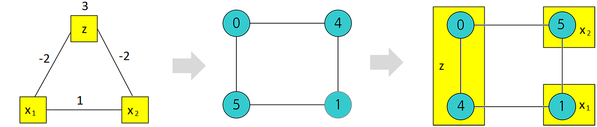

.. _embedding:

=========
Embedding
=========

Provides functions that map binary quadratic models and samples between a source graph and a target graph.

Example
=======

A sampler may not natively support a given problem graph. For example, the D-Wave
system does not natively support :math:`K_3` graphs. The Boolean
AND gate (:math:`x_3 \Leftrightarrow x_1 \wedge x_2` where :math:`x_3` is the
AND gate's output and :math:`x_1, x_2` the inputs) may be represented as
penalty model

.. math::

    x_1 x_2 - 2(x_1+x_2)x_3 +3x_3.

This penalty model can in turn be represented as the QUBO,

.. math::

    E(a_i, b_{i,j}; x_i) = 3x_3 + x_1x_2 - 2x_1x_3 - 2x_2x_3,

which is a fully connected :math:`K_3` graph.

Sampling this problem on a D-Wave system, therefore, requires minor-embedding.
Embedding in this case is accomplished by an edge contraction operation on the
target graph: two nodes (qubits) are chained to represent a single node.

  Embedding an AND gate represented by a :math:`K_3` graph onto the D-Wave
  system's graph. The leftmost graph is the source graph, which is the QUBO
  representing the AND gate; the middle one is the target graph, representing
  the D-Wave system; and in the rightmost graph, qubits 0 and 4 of the D-Wave
  system's graph are chained to represent the single node :math:`z` of the
  source graph.

Functions
=========

.. currentmodule:: dimod
.. autosummary::
   :toctree: generated/

   embed_bqm
   embed_ising
   embed_qubo
   unembed_response
   chain_break_frequency

Chain-Break Resolution
======================

.. automodule:: dimod.embedding.chain_breaks

.. currentmodule:: dimod.embedding

Generators
----------

.. autosummary::
   :toctree: generated/

   discard
   majority_vote
   weighted_random

Callable Objects
----------------

.. autosummary::
   :toctree: minimize_energy

   MinimizeEnergy
