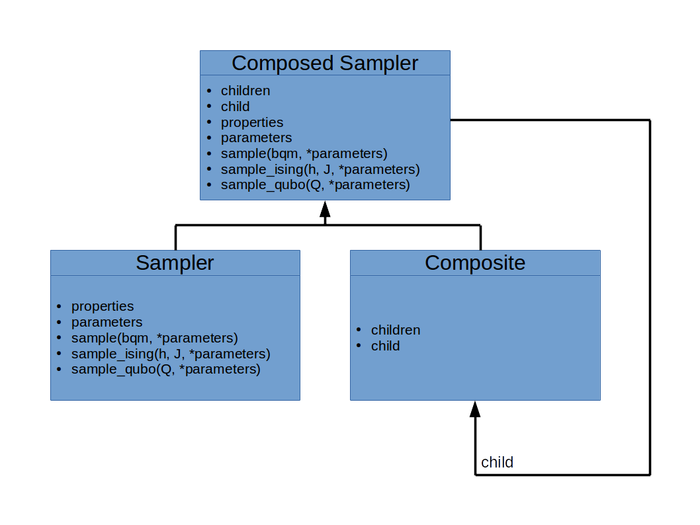

.. _sampler:

=======================
Samplers and Composites
=======================

.. list-table::
    :header-rows: 1

    *   - ABC
        - Inherits from
        - Abstract Properties
        - Abstract Methods
        - Mixins
    *   - :class:`.Sampler`
        -
        - :attr:`~.Sampler.parameters`, :attr:`~.Sampler.properties`
        - one of
          :meth:`~.Sampler.sample`, :meth:`~.Sampler.sample_ising`, :meth:`~.Sampler.sample_qubo`
        - :meth:`~.Sampler.sample`, :meth:`~.Sampler.sample_ising`, :meth:`~.Sampler.sample_qubo`
    *   - :class:`.Structured`
        -
        - :attr:`~.Structured.nodelist`, :attr:`~.Structured.edgelist`
        -
        - :attr:`~.Structured.structure`, :attr:`~.Structured.adjacency`
    *   - :class:`.Composite`
        -
        - :attr:`~.Composite.children`
        -
        - :attr:`~.Composite.child`
    *   - :class:`.ComposedSampler`
        - :class:`.Sampler`, :class:`.Composite`
        - :attr:`~.Sampler.parameters`, :attr:`~.Sampler.properties`, :attr:`~.Composite.children`
        - one of
          :meth:`~.Sampler.sample`, :meth:`~.Sampler.sample_ising`, :meth:`~.Sampler.sample_qubo`
        - :meth:`~.Sampler.sample`, :meth:`~.Sampler.sample_ising`, :meth:`~.Sampler.sample_qubo`,
          :attr:`~.Composite.child`

Creating a Sampler
==================

.. automodule:: dimod.core.sampler

.. currentmodule:: dimod
.. autoclass:: Sampler

Abstract Properties
-------------------

.. autosummary::
   :toctree: generated/

   Sampler.parameters
   Sampler.properties

Mixin Methods
-------------

.. autosummary::
   :toctree: generated/

   Sampler.sample
   Sampler.sample_ising
   Sampler.sample_qubo

Creating a Composed Sampler
===========================

    Composite Pattern

.. automodule:: dimod.core.composite

.. currentmodule:: dimod
.. autoclass:: ComposedSampler

.. currentmodule:: dimod
.. autoclass:: Composite

Abstract Properties
-------------------

.. autosummary::
   :toctree: generated/

   Composite.children

Mixin Properties
----------------

.. autosummary::
   :toctree: generated/

   Composite.child

Creating a Structured Sampler
=============================

.. automodule:: dimod.core.structured

.. currentmodule:: dimod
.. autoclass:: Structured

Abstract Properties
-------------------

.. autosummary::
   :toctree: generated/

   Structured.nodelist
   Structured.edgelist

Mixin Properties
----------------

.. autosummary::
   :toctree: generated/

   Structured.adjacency
   Structured.structure
